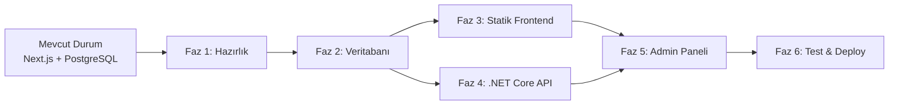
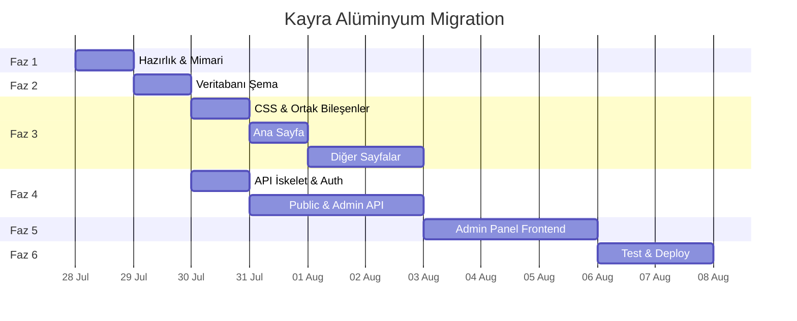

# Kayra Alüminyum — Statik HTML + .NET Core + MSSQL Geçiş Roadmap'i

## Büyük Resim



## Geliştirme Stratejisi

| Ortam | Frontend | Backend | Veritabanı |
|---|---|---|---|
| **Development (Mac)** | Statik HTML (Live Server) | .NET Core API (localhost, EF Core + Npgsql) | PostgreSQL 17 |
| **Production (Windows)** | Statik HTML (IIS) | .NET Core API (IIS) | MSSQL 2019 |

> [!IMPORTANT]
> **Neden iki veritabanı motoru?** Mac'te MSSQL çalıştırmak sorunlu (Docker ile ARM uyumsuzluk, Azure SQL Edge limitleri). Bu yüzden dev ortamında **EF Core + Npgsql** ile PostgreSQL kullanıyoruz. Production'da EF Core + SqlServer provider ile MSSQL 2019. Prisma şeması (`prisma/schema.prisma`) yalnızca **blueprint** olarak kalır; backend Prisma kullanmaz.
>
> **Kurulu araçlar:** .NET 10 SDK (10.0.301), Node 25, PostgreSQL 17. Production IIS'in desteklediği .NET sürümü açık soru (bkz. Open Questions).

---

## Faz 1: Hazırlık ve Mimari Tasarım (1 gün)

### 1.1 — Mevcut Durumun Fotoğrafını Çekmek

**Neden:** Geçiş sırasında hiçbir özelliği kaçırmamak için mevcut projenin tüm sayfalarını, API endpointlerini ve veritabanı tablolarını belgelemek gerekiyor.

**Yapılacaklar:**
- [ ] Tüm public sayfaların ekran görüntülerini almak (referans olarak)
- [ ] Tüm API endpoint'lerinin listesini çıkarmak (request/response formatları dahil)
- [ ] Mevcut Prisma şemasındaki tüm modelleri ve ilişkileri belgelemek
- [ ] Mevcut `public/` klasöründeki tüm asset'lerin envanterini çıkarmak

**Sonuç:** Tam bir "mevcut durum" belgesi → bundan sonraki tüm fazlar buna referans verecek.

### 1.2 — Yeni Proje Yapısını Oluşturmak

**Neden:** İki ayrı proje (frontend + backend) aynı repo'da yaşayacak. Klasör yapısı baştan doğru kurulmazsa ileride dosya karmaşası olur.

**Hedef yapı:**
```
kayra-aluminyum/
├── frontend/                    # Statik HTML/CSS/JS
│   ├── index.html
│   ├── urunler.html
│   ├── projeler.html
│   ├── katalog.html
│   ├── referanslar.html
│   ├── iletisim.html
│   ├── admin/
│   │   ├── index.html           # Admin dashboard (istatistik özet)
│   │   ├── login.html
│   │   ├── projeler.html
│   │   ├── urunler.html
│   │   ├── referanslar.html
│   │   ├── katalog.html         # Katalog/PDF yönetimi
│   │   ├── mesajlar.html
│   │   ├── ziyaretciler.html    # Ziyaretçi istatistikleri
│   │   ├── stats.html           # Detaylı istatistikler
│   │   ├── kullanicilar.html   # Admin kullanıcı yönetimi
│   │   └── ayarlar.html
│   ├── css/
│   │   ├── style.css            # Ana stiller
│   │   └── admin.css            # Admin paneli stilleri
│   ├── js/
│   │   ├── main.js              # Navbar, animasyonlar, genel
│   │   ├── i18n.js              # Dil desteği
│   │   ├── data.js              # Statik fallback veriler (ürünler, projeler vb.)
│   │   ├── api.js               # Backend API ile iletişim (fetch + cache)
│   │   └── admin/
│   │       ├── auth.js          # Admin oturum yönetimi
│   │       ├── dashboard.js     # Dashboard istatistikleri
│   │       ├── projects.js      # Proje CRUD
│   │       ├── products.js      # Ürün CRUD
│   │       ├── references.js    # Referans CRUD
│   │       ├── catalog.js       # Katalog/PDF yönetimi
│   │       ├── messages.js      # Mesaj yönetimi
│   │       ├── visitors.js      # Ziyaretçi istatistikleri
│   │       ├── stats.js         # Detaylı istatistikler
│   │       ├── users.js         # Admin kullanıcı yönetimi
│   │       └── settings.js      # Site ayarları yönetimi
│   ├── urunler/                # Ürün detay sayfaları (her ürün için)
│   │   ├── kis-bahcesi.html
│   │   ├── bioklimatik-pergola.html
│   │   ├── korkuluk.html
│   │   ├── cam-balkon.html
│   │   ├── giydirme-cephe.html
│   │   └── aluminyum-dograma.html
│   └── images/                  # Görseller (mevcut public/ içeriği)
│
├── backend/                     # ASP.NET Core Web API
│   ├── KayraApi/
│   │   ├── Controllers/         # API endpoint'leri
│   │   ├── Models/              # Entity sınıfları
│   │   ├── Data/                # DbContext, migration'lar
│   │   ├── Services/            # İş mantığı
│   │   ├── DTOs/                # Veri transfer nesneleri
│   │   └── Program.cs           # Uygulama giriş noktası
│   └── KayraApi.sln
│
├── prisma/                      # Geliştirme ortamı şeması (mevcut)
│   └── schema.prisma
│
└── docs/                        # Proje belgeleri
    └── api-spec.md              # API endpoint belgeleri
```

**Sonuç:** Net klasör yapısı → frontend ve backend bağımsız geliştirilebilir.

### 1.3 — Geliştirme Ortamını Hazırlamak

**Neden:** .NET Core SDK ve araçlarının Mac'te kurulması gerekiyor, yoksa backend geliştirmeye başlayamayız.

**Yapılacaklar:**
- [ ] .NET 10 SDK kurulu olduğunu doğrulama (`dotnet --version` → 10.0.301, mevcut)
- [ ] `dotnet new webapi -n KayraApi` ile boş API projesi oluşturma (backend/ altında)
- [ ] PostgreSQL 17'nin dev ortamında çalıştığını doğrulama (DB oluşturma)
- [ ] Live Server (VS Code extension) veya `npx serve` ile statik dosya sunucusu kurulumu
- [ ] CORS ayarlarını yapılandırma (frontend ↔ backend arası)

**Sonuç:** Geliştirme ortamı hazır → Faz 2 ve 3'e paralel başlanabilir.

---

## Faz 2: Veritabanı Şema Tasarımı (1 gün)

### 2.1 — Prisma Şemasını MSSQL 2019'a Uyarlamak

**Neden:** Mevcut Prisma şeması PostgreSQL'e özgü veri tipleri kullanıyor (`@db.Text`, `String[]` array'leri). MSSQL 2019 bunları desteklemiyor — uyarlanmalı.

**PostgreSQL → MSSQL Tip Dönüşümleri:**

| PostgreSQL (Mevcut) | MSSQL 2019 Karşılığı | Etkilenen Modeller |
|---|---|---|
| `String @db.Text` | `NVARCHAR(MAX)` | Project.description, Product.descTr/descEn, ContactMessage.message, AdminLog.details, SiteSetting.value |
| `String[]` (array) | Ayrı tablo (one-to-many) veya JSON string | Project.gallery, Project.products, Product.features |
| `Bytes` | `VARBINARY(MAX)` | Asset.data |
| `DateTime @default(now())` | `DATETIME2 DEFAULT GETDATE()` | Tüm modeller |
| `@default(cuid())` | `NEWID()` veya uygulama tarafında GUID | Tüm modeller |

> [!WARNING]
> **String[] array sorunu:** PostgreSQL native array desteklerken MSSQL desteklemez. İki çözüm var:
> 1. **JSON string olarak sakla** — `["img1.jpg","img2.jpg"]` şeklinde tek kolonda → Basit ama sorgulama zor
> 2. **Ayrı tablo oluştur** — `ProjectGallery`, `ProjectProduct`, `ProductFeature` tabloları → Doğru ama şema büyür
>
> **Önerim: JSON string** — Çünkü bu alanlar sadece okunuyor, üzerinde filtreleme/sorgulama yapılmıyor.

**Yapılacaklar:**
- [ ] Prisma şemasını MSSQL-uyumlu hale getirmek (dev ortamında PostgreSQL kalacak)
- [ ] Array alanlarını JSON string'e dönüştürmek
- [ ] Migration çalıştırıp test etmek

**Sonuç:** MSSQL-uyumlu şema hazır → .NET Core tarafında Entity Framework modelleri buna göre yazılacak.

### 2.2 — Entity Framework Core Model Sınıflarını Yazmak

**Neden:** .NET Core API, veritabanı ile Entity Framework Core üzerinden konuşacak. Prisma şeması bu modellerin "haritası" olacak.

**Prisma → EF Core eşleşmesi (örnek):**

```csharp
// Prisma'daki Project modeli → EF Core karşılığı
public class Project
{
    public string Id { get; set; } = Guid.NewGuid().ToString();
    public string Title { get; set; }
    public string Slug { get; set; }
    public string? Description { get; set; }
    public string Location { get; set; }
    public string Category { get; set; }
    public string Image { get; set; }
    public string GalleryJson { get; set; } = "[]";    // String[] → JSON string
    public string ProductsJson { get; set; } = "[]";    // String[] → JSON string
    public string? Area { get; set; }
    public string? Year { get; set; }
    public string? Client { get; set; }
    public bool IsActive { get; set; } = true;
    public int Order { get; set; } = 0;
    public DateTime CreatedAt { get; set; } = DateTime.UtcNow;
    public DateTime UpdatedAt { get; set; } = DateTime.UtcNow;
}
```

**Yapılacaklar:**
- [ ] Her Prisma modeli için EF Core entity sınıfı yazmak (8 model)
- [ ] `KayraDbContext` sınıfını oluşturmak
- [ ] Fluent API ile index ve constraint tanımları
- [ ] `dotnet ef migrations add Initial` ile migration oluşturmak

**Sonuç:** Veritabanı katmanı hazır → API endpoint'leri bu modelleri kullanacak.

### 2.3 — Seed Data Hazırlamak

**Neden:** Mevcut projede `prisma/seed.ts` dosyasında başlangıç verileri var. Bunları .NET Core tarafına taşımak gerekiyor, yoksa production'da boş veritabanı olur.

**Yapılacaklar:**
- [ ] Mevcut seed verilerini (ürünler, projeler, referanslar, admin kullanıcı) C# seed sınıfına taşımak
- [ ] `DbContext.OnModelCreating` içinde `HasData()` ile seed tanımlamak
- [ ] Geliştirme ortamında seed'in çalıştığını doğrulamak

**Sonuç:** Veritabanı ilk kurulumda dolu gelecek → Production'a geçişte veri eksikliği olmayacak.

---

## Faz 3: Statik Frontend Dönüşümü (3-4 gün)

> [!NOTE]
> Bu faz, Faz 4 ile **paralel** ilerleyebilir. Frontend geliştirirken mock data kullanılır, backend hazır olunca API'ye bağlanılır.

### 3.1 — Tasarım Sistemi ve Ortak Stiller (CSS)

**Neden:** Mevcut proje Tailwind CSS kullanıyor. Static HTML'de Tailwind'i build pipeline olmadan kullanamayız (veya CDN ile kullanırız ama dosya büyür). Vanilla CSS'e geçmek en temizi.

**Yapılacaklar:**
- [ ] Mevcut Tailwind sınıflarını analiz etmek (hangi renkler, spacing, font kullanılıyor)
- [ ] CSS custom properties (değişkenler) ile tasarım tokenlarını tanımlamak
- [ ] Reset/normalize CSS
- [ ] Responsive breakpoint'ler
- [ ] Ortak bileşen stilleri (butonlar, kartlar, grid, tipografi)
- [ ] Dark/light tema desteği (mevcut projede varsa)

**Sonuç:** `style.css` hazır → tüm sayfalar tutarlı görünecek.

### 3.2 — Navbar ve Footer (Ortak Layout)

**Neden:** Her sayfada tekrar eden navbar ve footer var. Bunlar JavaScript ile dinamik yüklenirse, her sayfada ayrı ayrı HTML yazmak gerekmez. Bir yerde değişiklik yapınca hepsi güncellenir.

**Yapılacaklar:**
- [ ] `components/navbar.html` ve `components/footer.html` partial dosyaları
- [ ] `main.js` içinde `loadComponent()` fonksiyonu — fetch ile HTML partial'ı yükler
- [ ] Mobil hamburger menü (mevcut davranışın aynısı)
- [ ] Scroll'da navbar stil değişimi
- [ ] Aktif sayfa vurgulama

**Alternatif yaklaşım:** Her HTML dosyasında navbar/footer'ı doğrudan yazmak (daha basit, JS gerektirmez, ama güncelleme zor).

**Sonuç:** Sayfa iskeletleri hazır → içerik sayfaları bu yapıya oturtulacak.

### 3.3 — Ana Sayfa (index.html)

**Neden:** Vitrin sayfası — ilk izlenim burada oluşuyor. Hero, ürünler, projeler, referanslar ve CTA bölümlerinden oluşuyor.

**Mevcut bileşenler ve dönüşümleri:**

| React Bileşeni | Statik Karşılığı |
|---|---|
| `<Hero />` | Hero section HTML + CSS animasyonu |
| `<ProductsSection />` | Ürün kartları — `data.js`'den verilerle JS ile render |
| `<ProjectsSection />` | Proje kartları — JS ile render |
| `<ReferencesSection />` | Logo carousel — CSS/JS ile sonsuz scroll |
| `<CtaSection />` | Statik HTML |

**Yapılacaklar:**
- [ ] Hero bölümü (arka plan görseli, başlık animasyonu, CTA butonları)
- [ ] Ürün kartları grid'i (data.js'den dinamik)
- [ ] Proje kartları grid'i (data.js'den dinamik)
- [ ] Referans logoları carousel (CSS `@keyframes` infinite scroll)
- [ ] CTA bölümü
- [ ] Scroll-reveal animasyonları (`IntersectionObserver` API ile)

**Sonuç:** Ana sayfa mevcut Next.js versiyonuyla birebir aynı görünecek.

### 3.4 — Ürünler Sayfası (urunler.html)

**Neden:** 6 ürün kartı ve her birine tıklayınca detay görüntüsü. Mevcut projede ayrı sayfalara yönlendirme var.

**Karar noktası:**
- **Seçenek A:** Her ürün için ayrı HTML dosyası (`urunler/kis-bahcesi.html`, `urunler/pergola.html` vb.)
- **Seçenek B:** Tek sayfa, URL hash ile detay gösterimi (`urunler.html#kis-bahcesi`)

**Önerim:** Seçenek A — SEO için daha iyi, her ürünün kendi meta tag'leri olur.

**Yapılacaklar:**
- [ ] Ürün listesi sayfası (6 ürün kartı)
- [ ] Her ürün için detay sayfası (6 adet)
- [ ] Ürün verilerini `data.js`'den okuma
- [ ] i18n desteği (TR/EN ürün açıklamaları)

**Sonuç:** Ürünler sayfası SEO-uyumlu ve çoklu dil destekli.

### 3.5 — Projeler Sayfası (projeler.html)

**Neden:** Kategori filtrelemeli proje galerisi. Filtreleme tarayıcıda JS ile yapılabilir.

**Yapılacaklar:**
- [ ] Proje kartları grid'i
- [ ] Kategori filtreleme (residential / commercial / corporate)
- [ ] Proje detay modalı veya ayrı sayfa
- [ ] Galeri lightbox (proje görselleri)
- [ ] Kullanılan ürünlerin listelenmesi

**Sonuç:** Filtreli proje galerisi — API'ye gerek kalmadan tamamen client-side çalışır.

### 3.6 — Diğer Sayfalar

**Katalog sayfası (katalog.html):**
- [ ] PDF görüntüleyici (mevcut `pdf.worker.min.mjs` kullanılabilir veya `<iframe>` ile)
- [ ] PDF indirme linki

**Referanslar sayfası (referanslar.html):**
- [ ] Referans logoları grid'i
- [ ] data.js'den verilerle render

**İletişim sayfası (iletisim.html):**
- [ ] İletişim formu HTML
- [ ] Form validasyonu (JS)
- [ ] Backend API'ye form gönderimi (`fetch` ile POST)
- [ ] Harita embed (Google Maps iframe)
- [ ] İletişim bilgileri

**Sonuç:** Tüm public sayfalar tamamlanır.

### 3.7 — Çoklu Dil Sistemi (i18n.js)

**Neden:** Mevcut projede TR/EN dil desteği var. Static site'da bu JS ile `localStorage`'a kayıt + DOM manipülasyonu ile yapılır.

**Yaklaşım:**
```html
<!-- HTML'de data attribute ile -->
<h1 data-i18n="hero.title">Kış Bahçesi Sistemleri</h1>
```
```javascript
// i18n.js — dil değişince tüm [data-i18n] elemanlarını günceller
const lang = localStorage.getItem('lang') || 'tr';
document.querySelectorAll('[data-i18n]').forEach(el => {
  el.textContent = translations[lang][el.dataset.i18n];
});
```

**Yapılacaklar:**
- [ ] Mevcut `lib/i18n.tsx` dosyasındaki tüm çevirileri JS objesine taşımak
- [ ] `i18n.js` modülünü yazmak
- [ ] Dil değiştirme butonu
- [ ] `localStorage` ile tercih kaydetme
- [ ] Tüm sayfalara `data-i18n` attribute'larını eklemek

**Sonuç:** TR/EN geçişi mevcut projedeki gibi çalışır.

---

## Faz 4: ASP.NET Core Web API (3-4 gün)

> [!NOTE]
> Bu faz, Faz 3 ile **paralel** ilerleyebilir.

### 4.1 — Proje Iskeleti ve Yapılandırma

**Neden:** .NET Core API projesinin temelini kurmak gerekiyor. CORS, JSON ayarları, veritabanı bağlantısı gibi altyapı hazırlanmalı.

**Yapılacaklar:**
- [ ] `dotnet new webapi -n KayraApi` ile proje oluşturma
- [ ] NuGet paketleri: `Microsoft.EntityFrameworkCore`, `Microsoft.EntityFrameworkCore.SqlServer`, `Microsoft.EntityFrameworkCore.Design`, `Microsoft.AspNetCore.Authentication.JwtBearer`, `BCrypt.Net-Next`
- [ ] Geliştirme ortamı için: `Npgsql.EntityFrameworkCore.PostgreSQL` (Mac'te PostgreSQL kullanmak için)
- [ ] `appsettings.Development.json` → PostgreSQL connection string
- [ ] `appsettings.Production.json` → MSSQL connection string
- [ ] CORS policy: frontend origin'e izin ver
- [ ] JWT authentication middleware
- [ ] Global error handling middleware

**Çoklu veritabanı desteği (Dev: PostgreSQL, Prod: MSSQL):**
```csharp
// Program.cs
if (builder.Environment.IsDevelopment())
{
    builder.Services.AddDbContext<KayraDbContext>(options =>
        options.UseNpgsql(connectionString));  // Mac'te PostgreSQL
}
else
{
    builder.Services.AddDbContext<KayraDbContext>(options =>
        options.UseSqlServer(connectionString));  // Prod'da MSSQL 2019
}
```

**Sonuç:** API projesi çalışır durumda → endpoint'ler yazılmaya başlanabilir.

### 4.2 — Public API Endpoint'leri

**Neden:** Frontend'in veritabanından veri çekmesi gereken yerler için (ürünler, projeler, referanslar). İlk etapta public sayfalar `data.js` ile statik veri kullanacak, ama admin panelinden eklenen yeni veriler API'den gelecek.

**Mevcut API → Yeni API eşleşmesi:**

| Mevcut (Next.js) | Yeni (.NET Core) | Açıklama |
|---|---|---|
| `GET /api/products` | `GET /api/products` | Aktif ürünleri listele |
| `GET /api/projects` | `GET /api/projects` | Aktif projeleri listele |
| `GET /api/references` | `GET /api/references` | Aktif referansları listele |
| `GET /api/settings` | `GET /api/settings` | Site ayarlarını getir |
| `POST /api/contact` | `POST /api/contact` | İletişim formu gönderimi |
| `POST /api/visits` | `POST /api/visits` | Sayfa ziyaret kaydı |

**Yapılacaklar:**
- [ ] `ProductsController` — GET (list, filter)
- [ ] `ProjectsController` — GET (list, filter by category)
- [ ] `ReferencesController` — GET (list)
- [ ] `SettingsController` — GET
- [ ] `ContactController` — POST (validasyon + kayıt)
- [ ] `VisitsController` — POST (ziyaret kaydı: `path`, `ip`, `userAgent`, `referrer`, `country`, `city`, `language`, `device`, `browser`, `isBot`)

**Sonuç:** Public API hazır → frontend `data.js` yerine API'den veri çekebilir.

### 4.3 — Authentication (JWT)

**Neden:** Admin paneline sadece yetkili kişiler girebilmeli. Mevcut projede JWT tabanlı authentication var, aynı yapı korunacak.

**Akış:**
```
1. Admin login.html'de e-mail + şifre girer
2. POST /api/admin/login → sunucu şifreyi bcrypt ile doğrular
3. Başarılıysa JWT token döner
4. Frontend token'ı localStorage'a kaydeder
5. Sonraki isteklerde Authorization: Bearer <token> header'ı gönderilir
6. Sunucu middleware ile token'ı doğrular
```

**Yapılacaklar:**
- [ ] `POST /api/admin/login` endpoint'i
- [ ] `GET /api/admin/me` — mevcut kullanıcı bilgisi
- [ ] JWT token oluşturma ve doğrulama servisi
- [ ] `[Authorize]` attribute'u ile admin endpoint'lerini koruma
- [ ] BCrypt ile şifre hashleme

**Sonuç:** Güvenli admin girişi → yetkisiz erişim engellenir.

### 4.4 — Admin CRUD API Endpoint'leri

**Neden:** Admin panelinden ürün/proje/referans ekleme, düzenleme, silme işlemleri yapılabilmeli.

| Endpoint | Method | Açıklama |
|---|---|---|
| `/api/admin/projects` | GET, POST | Listele, yeni ekle |
| `/api/admin/projects/{id}` | GET, PUT, DELETE | Detay, güncelle, sil |
| `/api/admin/products` | GET, POST | Listele, yeni ekle |
| `/api/admin/products/{id}` | GET, PUT, DELETE | Detay, güncelle, sil |
| `/api/admin/references` | GET, POST | Listele, yeni ekle |
| `/api/admin/references/{id}` | GET, PUT, DELETE | Detay, güncelle, sil |
| `/api/admin/messages` | GET | Mesajları listele |
| `/api/admin/messages/{id}` | PATCH, DELETE | Okundu işaretle, sil |
| `/api/admin/stats` | GET | Dashboard istatistikleri |
| `/api/admin/visits` | GET | Ziyaret kayıtlarını listele (filtreli) |
| `/api/admin/visits/stats` | GET | Ziyaretçi istatistikleri (grafik verisi) |
| `/api/admin/users` | GET, POST | Admin kullanıcılarını listele/ekle |
| `/api/admin/users/{id}` | PUT, DELETE | Kullanıcı güncelle/sil |
| `/api/admin/cache/clear` | POST | Server-side önbelleği temizle |
| `/api/admin/settings` | GET, PUT | Ayarları getir, güncelle |

**Yapılacaklar:**
- [ ] Her model için CRUD controller'ı
- [ ] DTO sınıfları (request/response modelleri)
- [ ] Dosya upload endpoint'i (proje/ürün görselleri ve katalog PDF)
- [ ] Sıralama (order) ve aktiflik (isActive) yönetimi
- [ ] Mesaj okundu/spam işaretleme
- [ ] Admin kullanıcı CRUD (rol, şifre sıfırlama)
- [ ] Ziyaretçi listeleme + istatistik aggregation

**Sonuç:** Admin paneli tam işlevsel → mevcut Next.js admin'le aynı yeteneklere sahip.

### 4.5 — Dosya Upload Sistemi

**Neden:** Admin panelinden proje/ürün görseli yüklenmesi gerekiyor. Mevcut projede görseller veritabanında (Asset modeli, `Bytes` tipi) saklanıyor.

**MSSQL'de iki seçenek:**
1. **VARBINARY(MAX) ile veritabanında** — Mevcut yaklaşım, yedekleme kolay ama performans düşük
2. **Dosya sisteminde** — `wwwroot/uploads/` klasöründe, performans iyi

**Önerim:** Dosya sisteminde saklama (IIS üzerinde `wwwroot/uploads/`). Veritabanında sadece dosya yolunu tut.

**Yapılacaklar:**
- [ ] `POST /api/admin/upload` — multipart form-data ile dosya yükleme
- [ ] Dosya boyutu ve tip kontrolü
- [ ] Benzersiz dosya adı üretme (GUID)
- [ ] `GET /api/assets/{filename}` — dosya sunma

**Sonuç:** Görsel yükleme çalışır → admin panelinden proje/ürün görseli eklenebilir.

---

## Faz 5: Admin Paneli Frontend (2-3 gün)

> [!IMPORTANT]
> Faz 3 ve 4'ün tamamlanmasına bağımlıdır.

### 5.1 — Admin Layout ve Login

**Neden:** Admin panelinin kendi navbar'ı, sidebar'ı ve layout'u var. Public site'dan bağımsız bir tasarım.

**Yapılacaklar:**
- [ ] `admin/login.html` — login formu, JWT token alma
- [ ] `admin/index.html` — dashboard layout (sidebar + content area)
- [ ] `admin/js/auth.js` — token yönetimi, otomatik redirect (yetkisiz ise login'e)
- [ ] Sidebar navigasyonu (projeler, ürünler, referanslar, mesajlar, ayarlar)
- [ ] `admin.css` — admin paneli stilleri

**Sonuç:** Admin paneli iskeleti hazır → CRUD sayfaları eklenecek.

### 5.2 — Dashboard

**Yapılacaklar:**
- [ ] İstatistik kartları (toplam proje, ürün, mesaj, ziyaretçi)
- [ ] Son mesajlar listesi
- [ ] Ziyaretçi grafiği (basit canvas veya chart.js)
- [ ] `GET /api/admin/stats` API'sine bağlantı

### 5.3 — CRUD Sayfaları

**Her CRUD sayfası için aynı patern:**
1. Liste görünümü (tablo)
2. Ekle/Düzenle modalı veya formu
3. Silme onay diyaloğu
4. Sıralama (drag & drop veya ok butonları)

**Yapılacaklar:**
- [ ] Projeler CRUD (görsel upload dahil, galeri yönetimi)
- [ ] Ürünler CRUD (çoklu dil alanları — TR/EN başlık ve açıklama)
- [ ] Referanslar CRUD (logo upload)
- [ ] Katalog yönetimi (PDF upload, gösterim/indirme linki)
- [ ] Mesajlar (liste, okundu işaretle, sil)
- [ ] Ziyaretçiler (liste + filtre, grafik)
- [ ] Detaylı istatistikler (stats)
- [ ] Admin kullanıcı yönetimi (ekle, rol, şifre sıfırla)
- [ ] Ayarlar (site başlığı, telefon, adres vb. — TR/EN alanlar)

**Sonuç:** Admin paneli tam fonksiyonel → müşteri içerik yönetebilir.

---

## Faz 6: Test, Optimizasyon ve Deployment (2 gün)

### 6.1 — Lokal Test

**Neden:** Production'a çıkmadan önce tüm sistemin uçtan uca çalıştığını doğrulamak gerekiyor.

**Yapılacaklar:**
- [ ] Tüm public sayfaların görsel kontrolü (Next.js versiyonuyla karşılaştırma)
- [ ] Responsive test (mobil, tablet, desktop)
- [ ] TR/EN dil geçişi testi
- [ ] İletişim formu gönderimi testi
- [ ] Admin login → CRUD → logout akışı testi
- [ ] Dosya upload testi
- [ ] Tarayıcı uyumluluğu (Chrome, Firefox, Safari, Edge)

### 6.2 — PostgreSQL → MSSQL 2019 Migration

**Neden:** Dev ortamında PostgreSQL ile geliştirdik, production'da MSSQL 2019 çalışacak. EF Core migration'ları MSSQL provider ile yeniden oluşturulmalı.

**Adımlar:**
```
1. appsettings.Production.json'a MSSQL connection string ekle
2. dotnet ef migrations add InitialMssql --context KayraDbContext -- --environment Production
3. MSSQL 2019'da boş veritabanı oluştur
4. dotnet ef database update -- --environment Production
5. Seed data'nın uygulandığını doğrula
```

> [!CAUTION]
> **MSSQL 2019 limitleri:** `JSON_VALUE` ve `OPENJSON` destekler ama `JSON_ARRAY` (2022+) desteklemez. JSON string alanlarını parse etmek için `OPENJSON` kullanılmalı. EF Core seviyesinde bu fark şeffaf olacak.

### 6.3 — IIS Deployment

**Neden:** Windows hosting'de IIS çalışıyor. Hem statik dosyalar hem .NET Core API IIS üzerinden sunulacak.

**IIS Yapılandırma:**
```
IIS Site
├── / (root)                  → frontend/ klasörü (statik dosyalar)
│   ├── index.html
│   ├── urunler.html
│   └── ...
└── /api                      → .NET Core API (Application Pool)
    └── KayraApi.dll
```

**Yapılacaklar:**
- [ ] `dotnet publish -c Release` ile API'yi build etmek
- [ ] IIS'te Application Pool oluşturmak (.NET Core hosting bundle gerekli)
- [ ] Statik dosyaları root'a kopyalamak
- [ ] API'yi `/api` alt dizinine deploy etmek
- [ ] `web.config` dosyasını yapılandırmak
- [ ] HTTPS sertifikası kontrolü
- [ ] Connection string'i production değerlerine güncellemek
- [ ] Dosya upload dizini için yazma izni vermek

### 6.4 — DNS ve Son Kontroller

- [ ] Domain yönlendirmesini kontrol etmek
- [ ] Tüm sayfaları production ortamında test etmek
- [ ] Admin paneline production'da giriş yapıp test etmek
- [ ] Mevcut verileri (projeler, ürünler, referanslar) MSSQL'e aktarmak
- [ ] Google Analytics / ziyaretçi takibi entegrasyonu

---

## Zaman Çizelgesi



**Toplam tahmini süre: ~10-12 iş günü**

## Resolved Decisions

> [!IMPORTANT]
> 1. **Public sayfalarda veri kaynağı:** API'den fetch ile çekilsin; `data.js` yalnızca hata/ilk-yükleme için fallback ve SEO/initial-render için inline seed. Admin'den eklenen içerik anında görünür.
> 2. **Mevcut veriler:** Production sıfırdan girilecek — `prisma/seed.ts`'teki veriler C# seed'ine taşınacak (3 proje, 6 ürün, 14 referans, admin kullanıcı, 20 ayar).
> 3. **Görsel depolama:** Dosya sisteminde (`wwwroot/uploads/`), DB'de yalnızca dosya yolu. Mevcut `Asset` (binary) modeli kullanılmıyor.
> 4. **CSS:** Tailwind build pipeline istenmiyor → vanilla CSS + custom properties.
> 5. **i18n:** `localStorage` + `[data-i18n]` DOM güncellemesi (mevcut `lib/i18n.tsx` çevirileri birebir taşınacak).

## Open Questions

> [!IMPORTANT]
> 1. **Hosting .NET sürümü:** IIS hangi .NET Core sürümünü destekliyor? (Makinede .NET 10 SDK var; production IIS hosting bundle sürümü bilinmeli — uyumsuzluk varsa target framework düşürülecek: `dotnet new webapi --framework net8.0` vb.)
> 2. **MSSQL erişimi:** MSSQL 2019'a dev/test için uzaktan bağlantı mümkün mü, yoksa migration yalnızca hosting üzerinden mi çalıştırılacak? (`dotnet ef database update -- --environment Production`)
